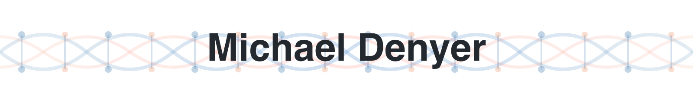
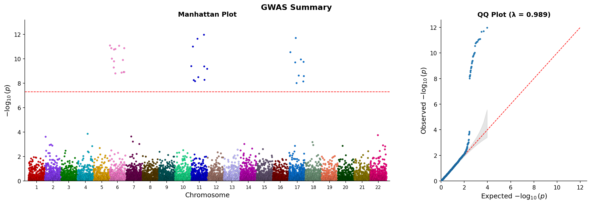
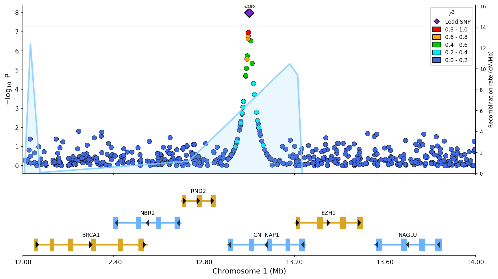
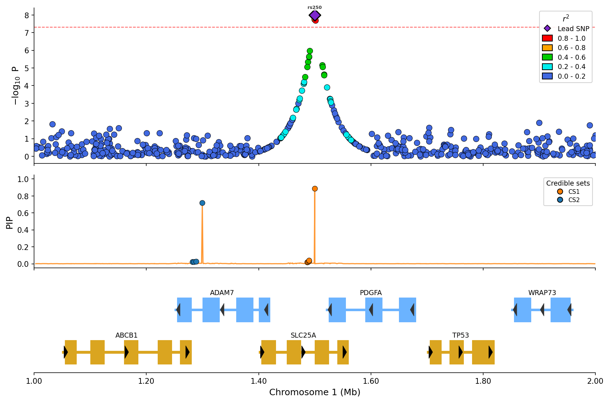

I build tools for genomics and data engineering.

## Current Focus

<!-- Update this section when your focus changes -->

Working on [pyLocusZoom](https://github.com/michael-denyer/pyLocusZoom) — an open-source library for publication-ready GWAS visualizations in Python. Think [qqman](https://github.com/stephenturner/qqman) and [locuszoomr](https://github.com/myles-lewis/locuszoomr), but Pythonic.

<table>
  <tr>
    <td colspan="2"></td>
  </tr>
  <tr>
    <td></td>
    <td></td>
  </tr>
</table>

---

<picture>
  <source media="(prefers-color-scheme: dark)" srcset="https://raw.githubusercontent.com/michael-denyer/michael-denyer/output/cafe-night.svg" />
  <source media="(prefers-color-scheme: light)" srcset="https://raw.githubusercontent.com/michael-denyer/michael-denyer/output/cafe-day.svg" />
  
</picture>

