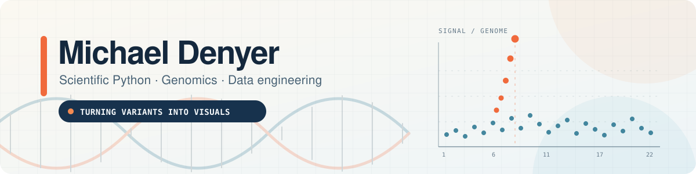
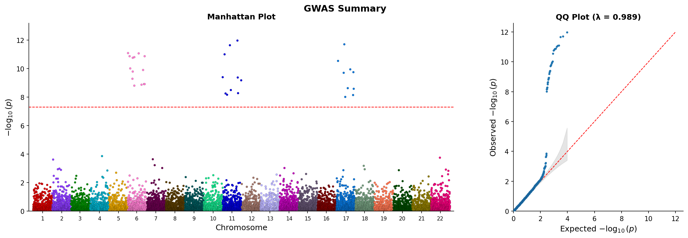

  <picture>
    <source media="(prefers-color-scheme: dark)" srcset="images/profile-banner-night.svg">
    <source media="(prefers-color-scheme: light)" srcset="images/profile-banner-day.svg">
    
  </picture>

I build tools where **bioinformatics**, **data engineering**, and **AI-assisted
development** meet—usually in Python, often open source, and always with an eye
on making difficult technical work easier to understand.

## 🧬 Bioinformatics

<table width="100%">
  <tr>
    <td width="50%" valign="top">
      

        
      

      
<strong><a href="https://github.com/michael-denyer/jamma">JAMMA</a></strong> is a modern Python and C reimplementation of GEMMA for large-scale GWAS. It keeps GEMMA's familiar CLI and file formats while adding memory-safety checks and delivering up to 30× faster LOCO analysis.

      
<a href="https://pypi.org/project/jamma/">PyPI</a> · <a href="https://github.com/michael-denyer/jamma#performance">Benchmarks</a>

    </td>
    <td width="50%" valign="top">
      

        
      

      
<strong><a href="https://github.com/michael-denyer/pyLocusZoom">pyLocusZoom</a></strong> turns GWAS results into publication-ready and interactive figures: regional association plots, gene tracks, fine-mapping, PheWAS, LD heatmaps, forest plots, and more.

      
<a href="https://pypi.org/project/pylocuszoom/">PyPI</a> · <a href="https://github.com/michael-denyer/pyLocusZoom#features">Features</a>

    </td>
  </tr>
</table>

## 🤖 AI development

Tools that give coding agents better context, stronger workflows, and real
language intelligence.

<table width="100%">
  <tr>
    <td width="50%" valign="top">
      <strong><a href="https://github.com/michael-denyer/pyrefly-lsp-cc-plugin">Pyrefly LSP plugin</a></strong> 
      Fast Python type checking and language intelligence packaged for Claude Code.
    </td>
    <td width="50%" valign="top">
      <strong><a href="https://github.com/michael-denyer/terraform-lsp-cc-plugin">Terraform LSP plugin</a></strong> 
      Terraform language-server integration packaged as a Claude Code plugin.
    </td>
  </tr>
  <tr>
    <td width="50%" valign="top">
      <strong><a href="https://github.com/michael-denyer/marksman-lsp-cc-plugin">Marksman LSP plugin</a></strong> 
      Markdown navigation and language intelligence for Claude Code.
    </td>
    <td width="50%" valign="top">
      <strong><a href="https://github.com/michael-denyer/pstack-claude">pstack for Claude Code</a></strong> 
      Rigorous agent workflows ported to Claude Code primitives for reviewing, debugging, and shipping software.
    </td>
  </tr>
  <tr>
    <td colspan="2" valign="top">
      <strong><a href="https://github.com/michael-denyer/memory-mcp">Memory MCP</a></strong> 
      A persistent second brain for AI assistants, combining a zero-latency hot cache with semantic recall, knowledge-graph links, and pattern mining.
    </td>
  </tr>
</table>

## 🛠️ Other apps

<table width="100%">
  <tr>
    <td width="50%" valign="top">
      

        
      

      
<strong><a href="https://github.com/michael-denyer/black-box-unlock">Black Box Unlock</a></strong> investigates a codebase like a crime scene. It ranks hotspots, hidden coupling, ownership risk, CI failures, and defect history so reviews and refactors start where the evidence points.

    </td>
    <td width="50%" valign="top">
      

        
      

      
<strong><a href="https://github.com/michael-denyer/everything-must-go">Everything Must Go</a></strong> is a WebGL art piece in which a spinning black hole consumes a procedurally generated cosmos over twelve minutes—then the universe is born again.

      
<a href="https://michael-denyer.github.io/everything-must-go/">Launch the experience ↗</a>

    </td>
  </tr>
</table>

## 🤝 Open-source contributions

<table width="100%">
  <tr>
    <td width="50%" valign="top">
      <strong><a href="https://github.com/JustVugg/colibri">JustVugg/colibri</a></strong> 
      ARM kernel performance, profiling accuracy, portability, and memory-management fixes for a tiny C inference engine. 
      <a href="https://github.com/JustVugg/colibri/pulls?q=is%3Apr+author%3Amichael-denyer">View contributions →</a>
    </td>
    <td width="50%" valign="top">
      <strong><a href="https://github.com/bioconda/bioconda-recipes">bioconda/bioconda-recipes</a></strong> 
      Added and maintained the pyLocusZoom package recipe for the Bioconda ecosystem. 
      <a href="https://github.com/bioconda/bioconda-recipes/pull/62201">View contribution →</a>
    </td>
  </tr>
  <tr>
    <td width="50%" valign="top">
      <strong><a href="https://github.com/satchellhong/qqman">satchellhong/qqman</a></strong> 
      Modernised the Python package for current Python 3.10+ environments. 
      <a href="https://github.com/satchellhong/qqman/pull/3">View contribution →</a>
    </td>
    <td width="50%" valign="top">
      <strong><a href="https://github.com/databricks/delta-live-tables-notebooks">databricks/delta-live-tables-notebooks</a></strong> 
      Updated public Delta Live Tables examples across retail, loan-risk, and Wikipedia workloads. 
      <a href="https://github.com/databricks/delta-live-tables-notebooks/pulls?q=is%3Apr+author%3Amichael-denyer">View contributions →</a>
    </td>
  </tr>
</table>

---

  
<strong>Meanwhile, at the Commit Café…</strong>

  
Repositories become cats, recent commits become yarn, open pull requests wait at the door, and the contribution streak fills the food bowl.

  <picture>
    <source media="(prefers-color-scheme: dark)" srcset="https://raw.githubusercontent.com/michael-denyer/michael-denyer/output/cafe-night.svg">
    <source media="(prefers-color-scheme: light)" srcset="https://raw.githubusercontent.com/michael-denyer/michael-denyer/output/cafe-day.svg">
    
  </picture>

