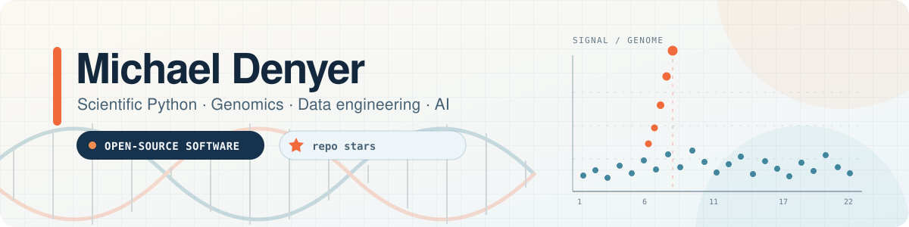

  <picture>
    <source media="(prefers-color-scheme: dark)" srcset="images/profile-banner-night.svg">
    <source media="(prefers-color-scheme: light)" srcset="images/profile-banner-day.svg">
    
  </picture>

I write software for bioinformatics, data engineering, and AI-assisted development, mostly in Python and C.

[Bioinformatics](#bioinformatics) · [AI development](#ai-development) · [Other apps](#other-apps) · [Contributions](#open-source-contributions) · [Website](https://michael-denyer.github.io/)

## Bioinformatics

<table width="100%">
  <tr>
    <td>
      
      <h3><a href="https://github.com/michael-denyer/jamma">JAMMA</a></h3>
      
A Python and C implementation of GEMMA for large-scale GWAS. It uses GEMMA's CLI and file formats and adds memory-safety checks. LOCO benchmarks show speedups of up to 30×.

      
<a href="https://pypi.org/project/jamma/">PyPI</a> · <a href="https://github.com/michael-denyer/jamma#performance">Benchmarks</a> · <a href="https://github.com/michael-denyer/jamma-lean-proofs">Lean 4 proofs</a>

      
For large JAMMA analyses, my <a href="https://github.com/michael-denyer/numpy-mkl">numpy-mkl fork</a> builds NumPy and SciPy wheels with Intel MKL and 64-bit NumPy indexing.

    </td>
  </tr>
  <tr>
    <td>
      
      <h3><a href="https://github.com/michael-denyer/fast-beagle-5.5">Fast Beagle</a></h3>
      
C ports of Beagle 5.4 and 5.5 for genotype phasing and imputation. They reduce runtime and memory use and add BGEN output. Each edition produces the same VCF bytes as its matching Java release at the same thread count.

      
<a href="https://github.com/michael-denyer/fast-beagle-5.5">Beagle 5.5 edition</a> · <a href="https://github.com/michael-denyer/fast-beagle-5.4">Beagle 5.4 edition</a>

    </td>
  </tr>
  <tr>
    <td>
      
      <h3><a href="https://github.com/michael-denyer/pyLocusZoom">pyLocusZoom</a></h3>
      
Draws static and interactive GWAS plots in Python, including regional associations, gene tracks, fine-mapping, PheWAS, LD heatmaps, and forest plots.

      
<a href="https://pypi.org/project/pylocuszoom/">PyPI</a> · <a href="https://github.com/michael-denyer/pyLocusZoom#features">Features</a>

      

      
Manhattan and QQ plots produced with pyLocusZoom.

    </td>
  </tr>
</table>

## AI development

<table width="100%">
  <tr>
    <td width="50%" valign="top">
      <h3><a href="https://github.com/michael-denyer/pstack-claude">pstack</a></h3>
      
Agent workflows for writing, reviewing, and debugging code, adapted from Lauren Tan's pstack. Supports Claude Code, Codex, OpenCode, Gemini CLI, and Prime Agent.

    </td>
    <td width="50%" valign="top">
      <h3><a href="https://github.com/michael-denyer/memory-mcp">Memory MCP</a></h3>
      
Stores and retrieves context for AI assistants using a hot cache, semantic search, and a knowledge graph. It also finds recurring patterns.

    </td>
  </tr>
</table>

| Tool | What it does |
| :--- | :--- |
| [Pyrefly](https://github.com/michael-denyer/pyrefly-lsp-cc-plugin) · [Terraform](https://github.com/michael-denyer/terraform-lsp-cc-plugin) · [Marksman](https://github.com/michael-denyer/marksman-lsp-cc-plugin) | Claude Code language-server plugins for Python, Terraform, and Markdown. |
| [bonsai-agent](https://github.com/michael-denyer/bonsai-agent) | Runs Claude Code tasks on a local Bonsai 2 27B model through MLX on Apple Silicon. |
| [Signal](https://github.com/michael-denyer/signal-output-style) | A Claude Code output style for concise answers and numbers with units and sources. |
| [claude-mem-lean](https://github.com/michael-denyer/claude-mem-lean) | My fork of Claude-Mem, which preserves agent context across sessions. |

## Other apps

<table width="100%">
  <tr>
    <td width="50%" valign="top">
      <h3><a href="https://github.com/michael-denyer/black-box-unlock">Black Box Unlock</a></h3>
      

      
Helps prioritise reviews and refactors using code hotspots, coupling, ownership, CI failures, and bug history.

    </td>
    <td width="50%" valign="top">
      <h3><a href="https://github.com/michael-denyer/everything-must-go">Everything Must Go</a></h3>
      

      
A WebGL animation of a black hole consuming a generated universe. The twelve-minute sequence repeats.

      
<a href="https://michael-denyer.github.io/everything-must-go/">Open animation</a>

    </td>
  </tr>
</table>

[The Aether Works](https://github.com/michael-denyer/michael-denyer.github.io) is my personal site, an animated steampunk workshop with cats and gauges that show GitHub activity. [Open site](https://michael-denyer.github.io/).

## Open-source contributions

| Project | Contributions |
| :--- | :--- |
| [colibri](https://github.com/JustVugg/colibri) | ARM kernel performance, profiling, portability, and memory-management fixes. [Pull requests](https://github.com/JustVugg/colibri/pulls?q=is%3Apr+author%3Amichael-denyer). |
| [code-review-graph](https://github.com/tirth8205/code-review-graph) | R and notebook parsing, plus module-scope call-graph correctness. [Pull requests](https://github.com/tirth8205/code-review-graph/pulls?q=is%3Apr+author%3Amichael-denyer). |
| [qqman](https://github.com/satchellhong/qqman) | Modernised the Python package for Python 3.10+. [Pull request](https://github.com/satchellhong/qqman/pull/3). |
| [Bioconda](https://github.com/bioconda/bioconda-recipes) | Recipes for pyLocusZoom and Fast Beagle. [Pull requests](https://github.com/bioconda/bioconda-recipes/pulls?q=is%3Apr+author%3Amichael-denyer) · [My fork](https://github.com/michael-denyer/bioconda-recipes). |

---

  <h3>Commit Café</h3>
  
Cats represent repositories, yarn represents recent commits, the dog tracks open pull requests, and the food bowl shows the contribution streak.

  <picture>
    <source media="(prefers-color-scheme: dark)" srcset="https://raw.githubusercontent.com/michael-denyer/michael-denyer/output/cafe-night.svg?v=12">
    <source media="(prefers-color-scheme: light)" srcset="https://raw.githubusercontent.com/michael-denyer/michael-denyer/output/cafe-day.svg?v=12">
    
  </picture>

