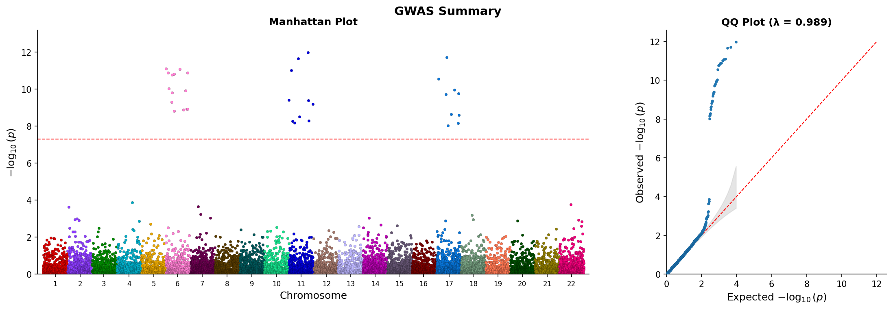

  <picture>
    <source media="(prefers-color-scheme: dark)" srcset="https://raw.githubusercontent.com/michael-denyer/michael-denyer/output/profile-banner-night.svg">
    <source media="(prefers-color-scheme: light)" srcset="https://raw.githubusercontent.com/michael-denyer/michael-denyer/output/profile-banner-day.svg">
    
  </picture>

I build bioinformatics and AI tools for the jobs that eat your afternoon: slow analyses, unfamiliar codebases, and agents that need the same explanation again. Mostly Python and C, with occasional detours into [cats](https://michael-denyer.github.io/) and [cosmic destruction](https://michael-denyer.github.io/everything-must-go/).

[Bioinformatics](#bioinformatics) · [AI development](#ai-development) · [Other apps](#other-apps) · [Contributions](#open-source-contributions) · [Website](https://michael-denyer.github.io/)

## Bioinformatics

<table width="100%">
  <tr>
    <td>
      <h3><a href="https://github.com/michael-denyer/jamma">&nbsp;&nbsp;&nbsp;JAMMA</a></h3>
      
Get more GWAS done with the compute you have. JAMMA accelerates kinship and association testing with native C kernels, processes genotypes in chunks to control memory use, and reuses eigendecompositions across phenotypes. Keep familiar GEMMA commands or use the Python API.

      
<a href="https://pypi.org/project/jamma/">PyPI</a> · <a href="https://github.com/michael-denyer/jamma#performance">Benchmarks</a> · <a href="https://github.com/michael-denyer/jamma-lean-proofs">Lean 4 proofs</a>

      
My <a href="https://github.com/michael-denyer/numpy-mkl">numpy-mkl fork</a> builds Intel MKL NumPy and SciPy wheels with 64-bit NumPy indexing for much larger GWAS.

    </td>
  </tr>
  <tr>
    <td>
      <h3><a href="https://github.com/michael-denyer/fast-beagle-5.5">&nbsp;&nbsp;&nbsp;Fast Beagle</a></h3>
      
Phase and impute larger cohorts with less waiting and less RAM. These C ports of Beagle 5.4 and 5.5 preserve each Java release's VCF output byte for byte at the same thread count, and add BGEN output. The 5.5 benchmarks show 1.5× to over 3× faster runs, with memory use reduced by up to 3.5×.

      
<a href="https://github.com/michael-denyer/fast-beagle-5.5">Beagle 5.5 edition</a> · <a href="https://github.com/michael-denyer/fast-beagle-5.4">Beagle 5.4 edition</a> · <a href="https://github.com/michael-denyer/fast-beagle-5.5/blob/main/docs/perf-baseline.md">Benchmarks</a>

    </td>
  </tr>
  <tr>
    <td>
      <h3><a href="https://github.com/michael-denyer/pyLocusZoom">&nbsp;&nbsp;&nbsp;pyLocusZoom</a></h3>
      
Give your GWAS hits some context. Turn result tables into publication-ready figures or interactive plots, with LD, genes, and fine-mapping evidence alongside the association signal. Works with Pandas or PySpark, with built-in dog and cat references and support for other species.

      
<a href="https://pypi.org/project/pylocuszoom/">PyPI</a> · <a href="https://github.com/michael-denyer/pyLocusZoom#gallery">Plot gallery</a>

      

      
Manhattan and QQ plots produced with pyLocusZoom.

    </td>
  </tr>
</table>

## AI development

<table width="100%">
  <tr>
    <td width="50%" valign="top">
      <h3> <a href="https://github.com/michael-denyer/pstack-claude">pstack</a> </h3>
      
Make your coding agent earn its "done". Pstack gives it workflows to reproduce bugs, challenge designs, review changes, and verify the result. My port of Lauren Tan's pstack brings that discipline to the agents below.

      
Claude Code · Codex · OpenCode · Gemini CLI · Prime Agent

    </td>
    <td width="50%" valign="top">
      <h3> <a href="https://github.com/michael-denyer/memory-mcp">Memory MCP</a></h3>
      
Your assistant should remember why you made that decision. Memory MCP carries project knowledge between sessions, puts frequently used facts straight into Claude Code's context, and retrieves the rest by meaning.

      
Hot cache · Semantic search · Knowledge graph

    </td>
  </tr>
  <tr>
    <td width="50%" valign="top">
      <h3> Language servers</h3>
      
Help Claude Code follow definitions and references across Python, Terraform, and linked Markdown docs. Pyrefly also provides fast Python type checking, giving the agent more to work with when fixing errors.

      
<a href="https://github.com/michael-denyer/pyrefly-lsp-cc-plugin">Pyrefly</a> · <a href="https://github.com/michael-denyer/terraform-lsp-cc-plugin">Terraform</a> · <a href="https://github.com/michael-denyer/marksman-lsp-cc-plugin">Marksman</a>

    </td>
    <td width="50%" valign="top">
      <h3> <a href="https://github.com/michael-denyer/bonsai-agent">bonsai-agent</a></h3>
      
Give Claude Code a local helper. Delegate tasks to a Bonsai 2 27B model running on your Apple Silicon Mac through MLX. The server starts on demand and shuts down when idle, so you don't have to babysit it.

    </td>
  </tr>
  <tr>
    <td width="50%" valign="top">
      <h3> <a href="https://github.com/michael-denyer/signal-output-style">Signal</a></h3>
      
Claude has plenty to say. Signal helps it get to the point, with answers first, explanations sized to the question, and numbers backed by units and sources. A small output style for Claude Code.

    </td>
    <td width="50%" valign="top">
      <h3> <a href="https://github.com/michael-denyer/claude-mem-lean">claude-mem-lean</a></h3>
      
Pick up where the last session left off. My Claude-Mem fork captures tool activity and compresses it into summaries, so Claude can recover what happened without rereading the whole conversation.

    </td>
  </tr>
</table>

## Other apps

<table width="100%">
  <tr>
    <td width="50%" valign="top">
      <h3><a href="https://github.com/michael-denyer/black-box-unlock">Black Box Unlock</a></h3>
      

      
Investigate your codebase like a crime scene. Black Box Unlock combines change history, hidden coupling, ownership, and CI failures to help you choose what to review or refactor first. Use it from the CLI or give coding agents direct access through MCP.

    </td>
    <td width="50%" valign="top">
      <h3><a href="https://github.com/michael-denyer/everything-must-go">Everything Must Go</a></h3>
      

      
An interactive WebGL apocalypse. A spinning black hole consumes a procedural cosmos over twelve minutes, then a new universe takes its place. Stir the gas, feed the black hole, or just watch it all go.

      
<a href="https://michael-denyer.github.io/everything-must-go/">Feed the black hole</a>

    </td>
  </tr>
</table>

[The Aether Works](https://github.com/michael-denyer/michael-denyer.github.io) is my personal site, disguised as a steampunk workshop. There are cats, animated machinery, and gauges fed by GitHub activity. [Step inside](https://michael-denyer.github.io/).

## Open-source contributions

| Project | Contributions |
| :--- | :--- |
| [colibri](https://github.com/JustVugg/colibri) | Helping a tiny C inference engine run better on ARM, with kernel, profiling, portability, and memory-management fixes. [Pull requests](https://github.com/JustVugg/colibri/pulls?q=is%3Apr+author%3Amichael-denyer). |
| [code-review-graph](https://github.com/tirth8205/code-review-graph) | Teaching a code knowledge graph to read R and notebooks, and fixing how it tracks calls at module scope. [Pull requests](https://github.com/tirth8205/code-review-graph/pulls?q=is%3Apr+author%3Amichael-denyer). |
| [qqman](https://github.com/satchellhong/qqman) | Modernised the Python package for Python 3.10+. [Pull request](https://github.com/satchellhong/qqman/pull/3). |

---

  <h3>Meanwhile, at the Commit Café...</h3>
  
Repositories become cats, recent commits become yarn, open pull requests wait at the door, and the contribution streak fills the food bowl.

  <picture>
    <source media="(prefers-color-scheme: dark)" srcset="https://raw.githubusercontent.com/michael-denyer/michael-denyer/output/cafe-night.svg?v=12">
    <source media="(prefers-color-scheme: light)" srcset="https://raw.githubusercontent.com/michael-denyer/michael-denyer/output/cafe-day.svg?v=12">
    
  </picture>

